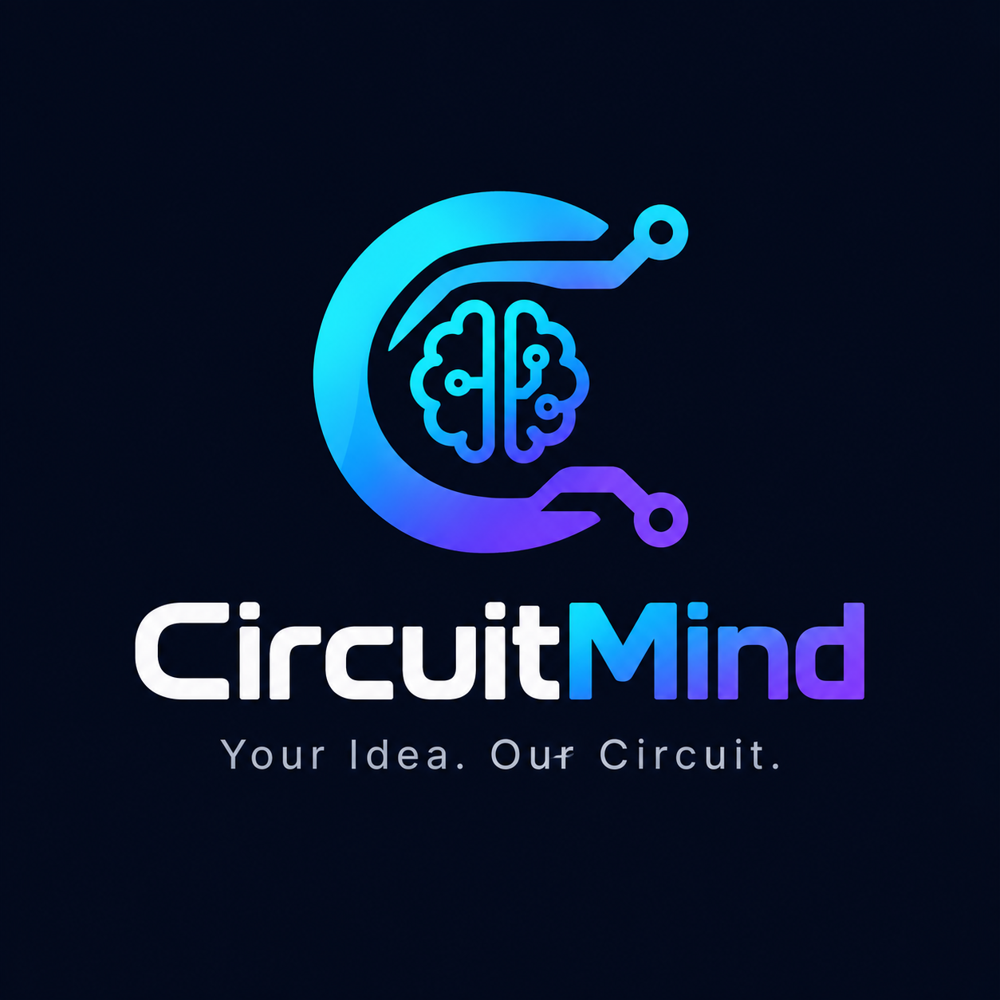

<div align="center">

  

  # CircuitMind
  ### *Embedded Circuit Architecture Synthesizer & Hardware Copilot*

  [](https://nodejs.org/)
  [](https://ai.google.dev/)
  [](LICENSE)

  **Transform natural language ideas and spare parts into production-ready embedded circuits, wiring tables, interactive schematics, and physical build verifications.**

</div>

---

## ⚡ Overview

**CircuitMind** is an intelligent embedded circuit synthesis platform designed for hardware engineers, IoT makers, students, and hobbyists. It bridges the gap between high-level concepts and physical hardware implementations by providing full architectural plans, verified pinouts, calculations, interactive SVG schematics, and camera-based breadboard debugging.

---

## ✨ Key Features

### 🧠 1. AI Circuit Synthesis
- **Idea to Architecture**: Describe any project (e.g., *"Automated solar-powered greenhouse monitor with soil moisture, OLED display, and relay water pump"*).
- **Comprehensive Outputs**:
  - 🧩 **Block Architecture Diagram** with visual data flow.
  - 📋 **Bill of Materials (BOM)** with estimated costs, packages, and voltage tolerances.
  - 🔌 **Pin-by-Pin Wiring Table** with explicit source/destination pins and functional notes.
  - 🛠️ **Step-by-Step Assembly Guide**.
  - 📐 **Electrical Engineering Calculations** (Ohm's law, pull-up resistors, battery runtimes, power dissipation).
  - ⚠️ **Safety & Protection Advisories** (Reverse polarity, overcurrent, flyback protection).
  - 🧪 **Testing & Bring-Up Checklist**.
  - 🏭 **Productization & PCB Roadmap** (From breadboard to custom PCB, enclosure, and certifications).

### 📐 2. Real-Time SVG Schematic Renderer
- Generates dynamic, clean electrical schematics directly from generated circuit connections.
- Features standard electronic symbols (Resistors, Capacitors, LEDs, Diodes, Transistors, Switches, ICs/Microcontrollers, Relays, Batteries, Ground, and Power Rails).

### 📸 3. "Bin-to-Build" (Spare Parts Photo Recognition)
- Have leftover components sitting in a drawer? Take a photo and upload it!
- CircuitMind's multimodal AI scans and identifies visible components (sensors, MCUs, modules) and designs your circuit around what you already own.

### 🔍 4. "Build Check" (Physical Wiring Verification)
- Once you've wired your breadboard, take a photo and upload it to **Build Check**.
- Multimodal computer vision cross-references your physical jumper wires against the expected pinout table and flags potential wiring errors, loose connections, or reversed polarity before power-up.

### 🛡️ 5. Rule-Based Engineering Verification Engine
- Real-time rule checks running alongside AI synthesis:
  - **Logic Level Warning**: Detects 3.3V MCUs (e.g., ESP32) paired directly with 5V logic sensors without level shifters/voltage dividers.
  - **Inductive Kickback Warning**: Verifies flyback diode protection across relay coils and DC motor circuits.

### 🎙️ 6. Voice Input Accessibility
- Speak your project requirements hands-free using browser audio recording.

### 💾 7. Export & Local Project History
- Download BOM as formatted `.csv`.
- Export complete technical architecture specs as `.md`.
- Save and reload previous circuit designs directly from browser storage.

---

## 🚀 Quick Start

### Prerequisites
- [Node.js](https://nodejs.org/) (v18 or higher recommended)
- A [Google Gemini API Key](https://aistudio.google.com/app/apikey)

### Installation

1. **Clone the repository:**
   ```bash
   git clone https://github.com/deepikavijay56-max/CircuitMInd.git
   cd CircuitMInd
   ```

2. **Install dependencies:**
   ```bash
   npm install
   ```

3. **Configure Environment Variables:**
   Create a `.env` file in the root directory (or copy from `.env.example`):
   ```env
   GEMINI_API_KEY=your_gemini_api_key_here
   PORT=3000
   ```

4. **Start the server:**
   ```bash
   npm start
   # or for development:
   node server.js
   ```

5. **Open in Browser:**
   Navigate to `http://localhost:3000`

---

## 🛠️ Tech Stack

- **Frontend**: Vanilla HTML5, CSS3 (Modern Cyber-Lab Theme with Glassmorphism, Dark/Light modes, JetBrains Mono & Inter typography), Pure Vanilla JavaScript (Zero external UI bloat).
- **Backend**: Node.js, Express.js.
- **AI / Multimodal**: Google Generative AI SDK (`@google/generative-ai`) leveraging Gemini Flash models.
- **Security & Reliability**: `express-rate-limit`, model fallback pipeline, prompt trimming, and resilient error recovery.

---

## 📁 Project Structure

```text
CircuitMind/
├── data/
│   └── component-specs.json    # Electrical specs for rule-based verification
├── public/
│   ├── index.html              # Core frontend application & interactive UI
│   └── logo.png                # Brand logo and favicon
├── .env.example                # Example environment variables
├── package.json                # Project manifest and dependencies
├── server.js                   # Express server, Gemini API integration & endpoints
└── README.md                   # Project documentation
```

---

## 🔌 API Reference

### `POST /api/generate-circuit`
Generates a full circuit architecture from requirements.
- **Body Parameters**:
  - `idea` *(string)*: Project description.
  - `skill` *(string, optional)*: Beginner, Intermediate, Advanced.
  - `budget` *(string, optional)*: Low, Medium, High.
  - `power` *(string, optional)*: USB, Battery, Wall Adapter, Solar.
  - `componentPhoto` *(string, optional)*: Base64 image of spare parts.
  - `voiceInput` *(string, optional)*: Base64 audio clip.

### `POST /api/verify-build`
Compares a physical breadboard photo against expected connections.
- **Body Parameters**:
  - `buildPhoto` *(string, required)*: Base64 photo of wired circuit.
  - `expectedConnections` *(array, required)*: Generated wiring table.
  - `components` *(array, required)*: Generated component list.

---

## 📄 License

This project is licensed under the [MIT License](LICENSE).

---

<div align="center">
  <sub>Built with ❤️ for hardware creators by <b>CircuitMind</b>.</sub>
</div>
